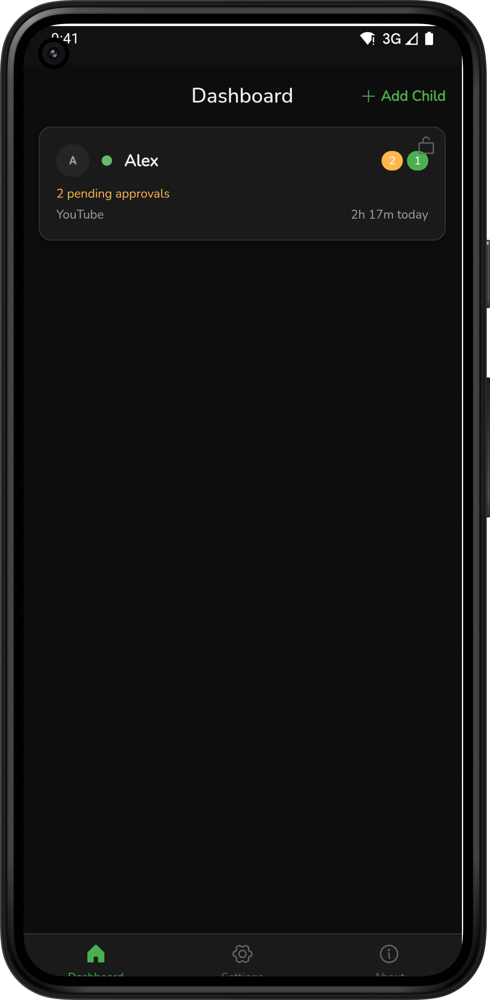
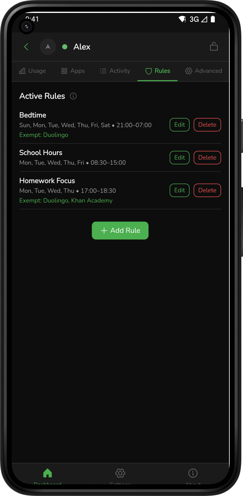
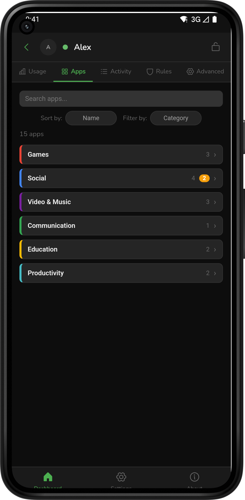
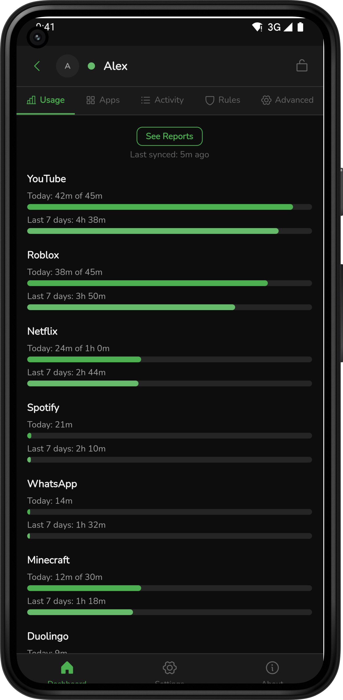
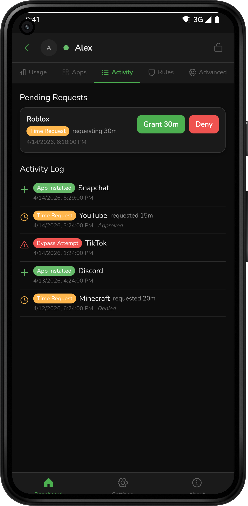
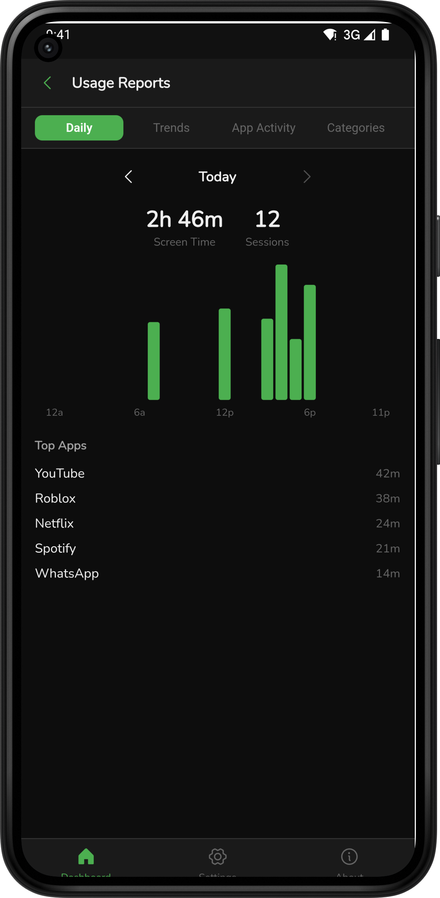
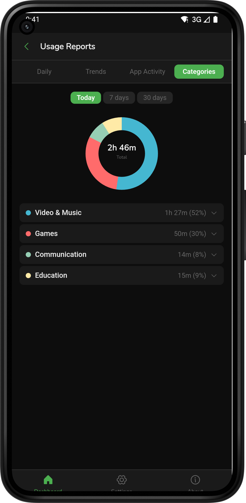
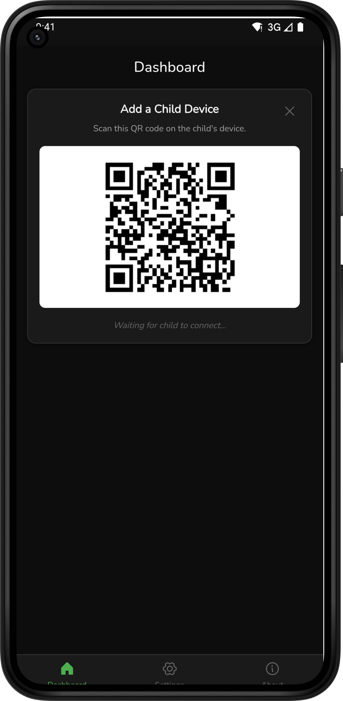
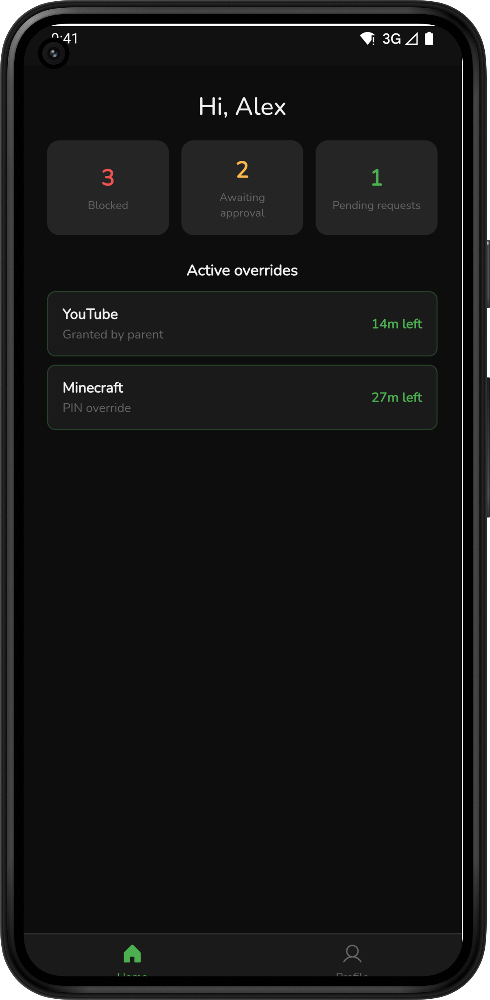
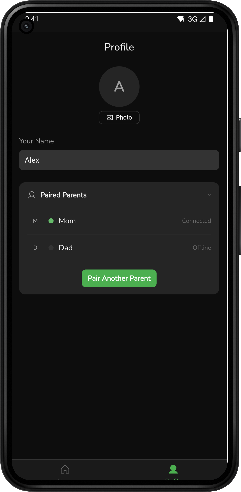

# 🍐🛡️ PearGuard

**A privacy-focused, peer-to-peer parental control app. Child device on Android, Windows or Linux; parent device on Android or iOS.**

PearGuard lets a parent device manage screen time and app access on a child device directly - no accounts, no servers, no subscriptions. Your family's data lives only on the devices you pair.

Every other product in this category renders a parent-facing dashboard, which means the child's activity has to sit on a company's servers for the product to work at all. PearGuard has no dashboard because it has nowhere to put one.

Part of the [PeerLoom](https://peerloomllc.com) suite of account-free, peer-to-peer apps.

---

## Screenshots

  
  
  
  
  
  
  
  
  
  

---

## Features

- **Screen time limits** - set daily time budgets and bedtime windows on the child device
- **Per-app policies** - allow, block or time-limit individual apps
- **Activity view** - see what's been used and when, directly from the parent device
- **Time requests** - child can request extra time; parent approves or denies from their device
- **Fully offline-first** - policies apply immediately on the child device; syncs whenever devices can reach each other
- **No accounts** - identity is a cryptographic key pair generated on your device; nothing is tied to an email or phone number
- **Narrow by design** - app usage and time, and nothing else. No message scanning, no image scanning, no browsing history, no location and no web filtering
- **Visible to the child** - PearGuard does not hide itself. It is a household rule, not covert monitoring
- **No data collection** - PeerLoom, Google and no third party ever sees your family's activity

---

## How It Works

PearGuard uses **peer-to-peer technology** powered by [Hypercore Protocol](https://hypercore-protocol.org) to sync policies and activity directly between parent and child devices.

### No servers
Most parental control apps route your child's activity through a central server. The app company can read your data, sell it, get hacked, go down or shut down. PearGuard has no central server. Your family's data never leaves your devices.

### How sync works
When the parent and child devices are online at the same time - whether on the same Wi-Fi network or anywhere on the internet - they find each other using a distributed hash table (DHT), a technology similar to how BitTorrent works. Once connected, they sync directly, device to device, with no middleman.

### Encrypted and signed
All data is encrypted in transit and every policy update is cryptographically signed by the parent device. The child device only applies policies it can verify came from a paired parent.

### Enforcement
On Android child devices, PearGuard uses Android's Accessibility Service and Device Admin APIs to enforce app blocks, time limits and bedtime windows. These are standard Android parental-control surfaces - the child cannot disable them without the parent's approval.

On Windows child devices, enforcement runs in user space: a foreground-window monitor closes blocked apps and an overlay covers them when a time limit or schedule kicks in. A watchdog service and scheduled task relaunch the client if it stops. See the [Windows Client](#windows-client) section for details.

Linux child builds ship as `.deb` and `.AppImage` alongside the Windows installer and use the same desktop client. Enforcement is more limited there: there is no process watchdog on Linux yet, so nothing relaunches the client if it is killed.

**Desktop enforcement is deterrence, not containment.** On both Windows and Linux the overlay runs at the child's own privilege level and covers the primary display only, and the watchdog runs as a user-level service the child can remove. A technically capable child with admin rights can defeat it. Android enforcement is the strong path; desktop is suited to younger children and to households where the rules are agreed rather than contested.

### Pairing
Parent and child pair via an invite link or QR code. The link encodes the cryptographic address of the pairing - there's no server involved. After pairing, both devices remember each other.

**Treat the invite as a secret and share it in person.** It currently carries no expiry, no authentication code and no single-use marker, so anyone who sees the link or QR before you pair could use it. In practice the 256-bit swarm topic is not guessable and the link is shared face to face, but binding the first pairing to the invited key is a known open item rather than a solved one.

---

## Privacy

- No accounts or sign-up required
- No analytics, tracking or telemetry
- No third-party SDKs
- All sync traffic is encrypted end-to-end
- Activity data stays on the parent and child devices - never uploaded anywhere

---

## Windows Client

In addition to the Android child app, PearGuard ships a Windows desktop child client. It runs the same P2P backend and UI as the mobile app, with user-space enforcement suited to younger kids.

### Install
Download the `pearguard-v<version>.exe` installer from the [GitHub release page](../../releases) and run it with administrator privileges.

> **Note:** the v1.0.20 release does not include the Windows `.exe`. Until that is fixed, install from [v1.0.19](../../releases/tag/v1.0.19), which does. The installer places PearGuard under `Program Files`, creates a Start Menu shortcut and registers a watchdog Windows Service plus a scheduled task so the client relaunches if it stops.

### Supported Versions
Windows 10 (version 1809 or later) and Windows 11, 64-bit.

### Pairing
Desktop machines have no camera, so Windows pairs via copy/paste:

1. On the parent device, open **Pair Device** and tap **Share Link** to copy the invite URL. Send the URL to the Windows machine by email, chat or any channel you like.
2. On Windows, copy the invite URL to the clipboard and click **Pair**. The client reads the clipboard and completes pairing.

### Known Limitations
- **Unsigned installer** - the `.exe` is not yet code-signed, so Windows SmartScreen warns on first download. Click "More info" then "Run anyway" to proceed.
- **Soft enforcement** - Windows enforcement runs in user space. A determined, technically savvy child with admin rights can bypass it by killing the PearGuard process. The Windows client is intended for younger children; for teens, use the Android child app.

---

## Known Limitations

- **Child device must be Android, Windows or Linux** - iOS does not expose the enforcement APIs required (Accessibility Service, Device Admin). The parent device can run Android or iOS.
- **Both devices must be online simultaneously** to sync policy changes or activity in real time - changes made offline sync the next time devices connect
- **Desktop enforcement is deterrence** - see the Enforcement section. Use the Android child app where enforcement has to hold against someone trying to break it
- **The system clock is trusted** - schedules, bedtimes and daily limits all read the device's local time. Android detects a manual clock change and alerts the parent, and the desktop client refuses budget resets it can prove are a timezone shift, but a changed clock can still buy time before a parent reacts
- **No web or content filtering, deliberately** - PearGuard does not filter URLs, DNS or search results, and will not. Doing so means routing or reading the child's browsing, which is exactly the thing this app exists not to do. Block the stock browser and allow-list a vetted kids' browser instead

---

## License

[MIT](LICENSE) © 2026 PeerLoom LLC

---

## Feedback & Bug Reports

Please open an [issue](../../issues) on GitHub. Include your platform (Android, iOS or Windows), OS version and a description of what happened.
